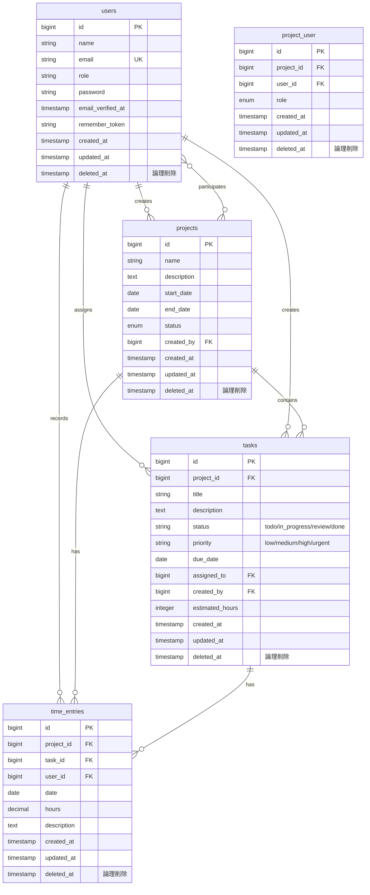

# CRMシステム ER図

## Mermaid ER図

## リレーションシップ詳細

### 1. User ↔ Project
- **多対多**: ユーザーは複数のプロジェクトに参加でき、プロジェクトには複数のユーザーが参加可能
- **中間テーブル**: `project_user` (役割: manager/member)
- **1対多**: ユーザーは複数のプロジェクトを作成可能（`created_by`）

### 2. User ↔ Task
- **1対多**: ユーザーは複数のタスクを担当可能（`assigned_to`）
- **1対多**: ユーザーは複数のタスクを作成可能（`created_by`）

### 3. User ↔ TimeEntry
- **1対多**: ユーザーは複数の工数記録を作成可能

### 4. Project ↔ Task
- **1対多**: プロジェクトは複数のタスクを持つ

### 5. Project ↔ TimeEntry
- **1対多**: プロジェクトは複数の工数記録を持つ

### 6. Task ↔ TimeEntry
- **1対多**: タスクは複数の工数記録を持つ（タスクIDはNULL可）

## 制約とインデックス

### 主キー（Primary Keys）
- `users.id`
- `projects.id`
- `project_user.id`
- `tasks.id`
- `time_entries.id`

### 外部キー（Foreign Keys）
- `projects.created_by` → `users.id` (CASCADE)
- `project_user.project_id` → `projects.id` (CASCADE)
- `project_user.user_id` → `users.id` (CASCADE)
- `tasks.project_id` → `projects.id` (CASCADE)
- `tasks.assigned_to` → `users.id` (SET NULL)
- `tasks.created_by` → `users.id` (CASCADE)
- `time_entries.project_id` → `projects.id` (CASCADE)
- `time_entries.task_id` → `tasks.id` (SET NULL)
- `time_entries.user_id` → `users.id` (CASCADE)

### ユニーク制約
- `users.email` (UNIQUE)
- `project_user(project_id, user_id)` (UNIQUE)

### デフォルト値
- `users.role`: 'member'
- `projects.status`: 'planning'
- `project_user.role`: 'member'
- `tasks.status`: 'todo'
- `tasks.priority`: 'medium'

### 論理削除（ソフトデリート）
以下のテーブルは削除時に `deleted_at` に日時を設定する論理削除とする。`deleted_at` は NULL 可。

| テーブル        | 備考 |
|-----------------|------|
| `users`         | 論理削除。削除済みユーザーはログイン不可 |
| `projects`      | 論理削除 |
| `project_user`  | 論理削除。メンバー除外時は当該 pivot 行に deleted_at を設定 |
| `tasks`         | 論理削除 |
| `time_entries`  | 論理削除 |

